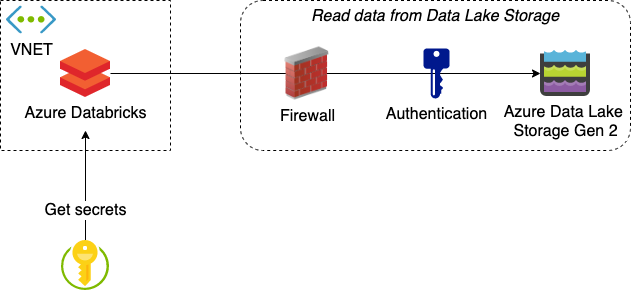

# Terraforming Azure Data Services
_Updated: 2020-02-28_

**Contents**: Updated materials from demo given in Finland Microsoft BI & Power BI User Group session 2020-02-05. See the accompanying PDF of the presentation for more background information.

**Author**: Elias Vakkuri ([LinkedIn](www.linkedin.com/in/elias-vakkuri))

## Prerequisites
* Access to an Azure Subscription
  * NOTE: All Azure regions might not have all the services available, if this happens try to deploy to another region
* Terraform installed (see e.g. PDF presentation for instructions)
* Azure CLI installed
* Authenticated to Azure
  * Terraform can use e.g. your existing Azure CLI login transparently

## Usage

### Architecture overview

### Terraform deployment
The code in 'terraform' folder will deploy the following Azure resources:
* Azure Data Lake Storage Gen 2 with service firewall
* Azure Databricks with VNET injection (together with the networking resources)
* Azure Key Vault with Data Lake Storage Account key and Service Principal credentials for authentication
* Other supporting resources such as role assignments

If you need help getting started, see the accompanying PDF, section "Terraform – Installation & Getting Started" for some ideas.

### Tasks after deployment

**Adding the Key Vault -backed secret scope** 

In order for Databricks to connect to the Key Vault, you need to add the Key Vault as a secret scope. As of writing, this requires some manual work.

To add the secret scope, navigate to your deployed Azure Databricks Workspace, then after the 

https://westeurope.azuredatabricks.net/?o=\<Your workspace id\>#secrets/createScope

See the full documentation here: https://docs.microsoft.com/en-us/azure/databricks/security/secrets/secret-scopes#--create-an-azure-key-vault-backed-secret-scope

**Uploading the test notebook to Databricks**

After running the Terraform deployment you have infrastructure ready to start receiving and analysing data. You can use the accompanying Databricks Notebook file "AdlsConnections.dbc" to test that the connections between the components work.
